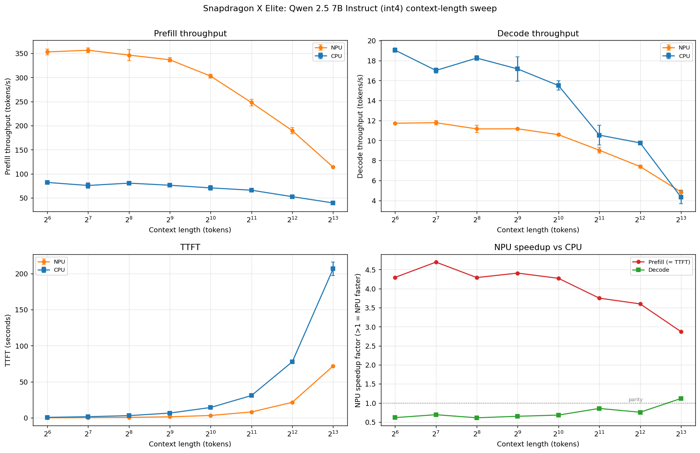
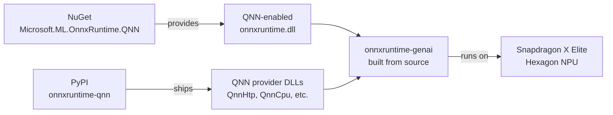
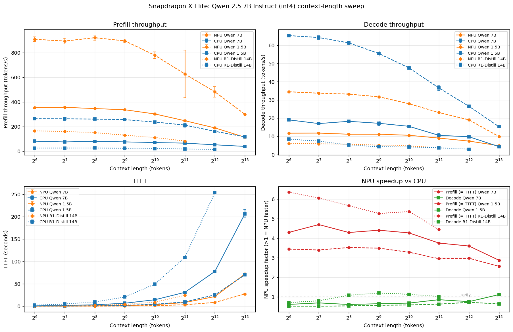

# Snapdragon X Elite LLM Example

> Example project for running LLM inference on Qualcomm Snapdragon X Elite NPU via ONNX Runtime QNN Execution Provider on Windows ARM64.

> ⚠ **Platform**: Windows 11 ARM64 (Snapdragon X Elite / Plus) + Python 3.14 only. **Not** compatible with x86_64, Linux, or macOS.

## Headline Finding

**Qwen 2.5 7B Instruct (int4), context-length sweep 64 → 8192 tokens, median of 3 runs:**



Full data: [`results/context_sweep_qwen7b.md`](results/context_sweep_qwen7b.md)

### Three things that are true but not usually separated

1. **NPU wins prefill by 3-5x across every context length.** Peak NPU prefill is **356 t/s** at ctx=128 (vs CPU's 76 t/s). The advantage degrades slowly as attention becomes O(n²)-heavy, from 4.7x at short context to 2.9x at 8192 — but it never disappears.

2. **NPU wins TTFT by 3-5x.** Same multiplier as prefill (mathematically, `TTFT = ctx / prefill_tps`). At long prompts this is felt immediately: 72 s on NPU vs **206 s** on CPU for an 8192-token system prompt.

3. **CPU's decode advantage shrinks from decisive (+63% at short ctx) to within-noise at ctx=8192.** CPU Oryon's large cache and high memory bandwidth dominate at short KV cache sizes. Once the KV cache (~115 KB/token at fp32) overflows L2 (~12 MB at ~100 tokens), then LPDDR5x bandwidth at ~2 GB KV (at 8192 tokens), the CPU's advantage is consumed by KV streaming cost. At ctx=8192 the two engines are statistically indistinguishable (NPU 4.85 ± 0.11 t/s vs CPU 4.34 ± 0.67 t/s).

### What this means in practice

Stop asking "NPU or CPU". The right question is:

| Workload | Winner | Magnitude |
|---|---|---|
| Interactive chat, short prompts + short responses | CPU | Decode 1.5-1.6x faster |
| Interactive chat, long system prompt (≥1K tokens) | **NPU for prefill** | TTFT 3-5x faster (the user-perceived delay) |
| Batch / offline summarization | **NPU** | Both TTFT and decode competitive at long context |
| Long context (≥4K) | NPU | CPU decode advantage has eroded |

The latent hypothesis this data motivates: **NPU prefill + CPU decode heterogeneous execution** ("Plan A" in [PROGRESS.md](PROGRESS.md)) could combine the best of both engines if the KV-cache hand-off works with Microsoft's independently-quantized Qwen 7B NPU + CPU models. We haven't prototyped it yet.

## Architecture

How the DLLs fit together — the source of most build-time pain:



- **QNN DLLs** come from the `onnxruntime-qnn` PyPI package (convenient packaging; no need to install QNN SDK separately at runtime).
- **onnxruntime.dll (with QNN EP built in)** comes from the NuGet `Microsoft.ML.OnnxRuntime.QNN` package, auto-downloaded during the genai source build.
- **onnxruntime-genai** must be built from source — PyPI wheels do not include QNN (see Pitfall #1).
- At runtime, both sets of DLLs must coexist in the `onnxruntime_genai` package directory (see Pitfall #4).

## Prerequisites

- **OS**: Windows 11 ARM64 (Snapdragon X Elite / Plus)
- **Visual Studio 2026** with C++ ARM64 build tools
- **Python 3.14.3** (conda-forge win-arm64 only provides 3.14)
- **CMake 4.3+**, **Ninja 1.11+**
- **Pixi** for Python environment management
- **onnxruntime-qnn** (PyPI, provides QNN DLLs)
- **onnxruntime-genai** (must build from source, see below)

## Quick Start

### Option 0: One-shot bootstrap (Qualcomm Cloud Device / fresh machine)

Takes a blank Windows 11 ARM64 box to first benchmark in ~40 minutes. Requires elevated PowerShell.

```powershell
# Download and run the bootstrap script
iwr -useb https://raw.githubusercontent.com/dakehero/snapdragon-xelite-llm-example/main/scripts/bootstrap_cloud.ps1 | iex
```

What it does: installs git/pixi/Foundry Local via winget → clones repo → sets up pixi env → downloads pre-built wheel from Releases → pulls Qwen 2.5 7B NPU+CPU models (~7 GB) → runs smoke test + full context-length sweep. Result lands in `results/context_sweep_qwen7b.md`.

> **Note on Smart App Control**: if it's ON, the script will warn and exit. You'll need to turn it off manually (Settings > Privacy & Security > Windows Security > App & browser control > Smart App Control settings). SAC cannot be re-enabled without a Windows reinstall.

### Option 1: Use Pre-built Wheel (Fastest)

For Windows ARM64 with Python 3.14, download the pre-built wheel from [GitHub Releases](https://github.com/dakehero/snapdragon-xelite-llm-example/releases):

```powershell
# 1. Setup environment
pixi install

# 2. Download and install pre-built wheel (includes QNN support)
#    Replace <VERSION> with the latest release tag, e.g., v0.14.0
$WheelUrl = "https://github.com/dakehero/snapdragon-xelite-llm-example/releases/download/<VERSION>/onnxruntime_genai-0.14.0.dev0-cp314-cp314-win_arm64.whl"
pixi run python -m pip install --force-reinstall --no-deps $WheelUrl

# 3. Copy DLLs (NuGet + QNN)
pixi run python scripts/install.py

# 4. Verify and run
make test
make run MODEL_DIR=/path/to/qnn-model
```

Or manually download the wheel from Releases and install locally.

### Option 2: Build from Source

If you need a different Python version or want to modify the source:

```powershell
# 1. Setup environment (installs onnxruntime-qnn and other deps via pixi)
pixi install

# 2. Build + install onnxruntime-genai with QNN (one command)
#    PyPI version does NOT include QNN - must build from source
#    This also auto-installs the wheel and copies required DLLs
make build-genai QNN_SDK_ROOT="C:\QNN\qairt\2.45.0.260326"

# 3. Verify
make test

# 4. Run inference
make run MODEL_DIR=/path/to/qnn-model
```

#### Build Details

There are two build paths available:

**Path A: Simple Build (Default)** — `make build` or `make build-genai`
- `make build` is an alias for `make build-genai` (default behavior)
- Downloads pre-built `Microsoft.ML.OnnxRuntime.QNN` from **NuGet** automatically
- Links genai against the NuGet QNN-enabled `onnxruntime.dll`
- Fastest option, no need to build onnxruntime from scratch

**Path B: Full Source Build** — `make build-ort` then `make build-genai`
- First builds onnxruntime base from source with QNN EP (`make build-ort`)
- Then builds genai linked against your custom onnxruntime (`make build-genai`)
- Use this if you need to modify onnxruntime itself or want complete control

> **Note**: `onnxruntime-genai` is intentionally excluded from `pixi.toml` to prevent `pixi install` from overwriting the custom-built QNN wheel with the standard PyPI version.

## Pitfalls & Solutions

These are the problems we encountered and how we solved them. If you're doing the same thing, these will save you hours.

### 1. PyPI `onnxruntime-genai` does NOT include QNN support

**Symptom**: `og.Model(config)` throws `RuntimeError: QNN execution provider is not supported in this build.`

**Root cause**: The standard `onnxruntime-genai` wheel on PyPI is built without QNN. Even though `og.is_qnn_available()` returns `True` (it's hardcoded in the source), the actual EP registration fails because the underlying `onnxruntime.dll` linked by genai doesn't know about QNN.

**Solution**: Build `onnxruntime-genai` from source. On Windows ARM64, the build system automatically downloads `Microsoft.ML.OnnxRuntime.QNN` NuGet package which contains QNN-enabled `onnxruntime.dll`.

### 2. QNN EP registration name must be `QNNExecutionProvider`, NOT `qnn`

**Symptom**: Same error as above, even after building from source and calling `og.register_execution_provider_library('qnn', ...)`.

**Root cause**: `onnxruntime-genai` internally calls `FindRegisteredEpDevices("QNNExecutionProvider")` to look up the registered EP. If you register with the name `"qnn"`, the lookup fails, and genai falls back to the legacy V1 API (`AppendExecutionProvider`), which also fails because the NuGet `onnxruntime.dll` doesn't have QNN built-in — it expects it as a plugin registered under the correct name.

**Solution**:
```python
# WRONG
og.register_execution_provider_library('qnn', onnxruntime_qnn.get_library_path())

# CORRECT
og.register_execution_provider_library('QNNExecutionProvider', onnxruntime_qnn.get_library_path())
```

### 3. MSVC requires `/EHsc` flag for C++ exception handling

**Symptom**: Build fails with `error C2220: warnings treated as errors` and `warning C4530: C++ exception handler used, but unwind semantics not enabled`

**Root cause**: The genai source code uses C++ exceptions, but the Ninja + MSVC build doesn't enable exception handling by default.

**Solution**: Pass `--cmake_extra_defines CMAKE_CXX_FLAGS=/EHsc` to the build command.

### 4. DLL version mismatch between PyPI onnxruntime and NuGet onnxruntime

**Symptom**: `og.Model(config)` still fails after building genai from source, even with correct registration name.

**Root cause**: The build links against NuGet's `onnxruntime.dll` (1.25.0-dev), but at runtime Python loads PyPI's `onnxruntime.dll` (1.24.4) from `onnxruntime/capi/`. The two DLLs have different ABIs — the QNN provider DLL built for 1.24.4 cannot be loaded by the 1.25.0-dev DLL, and vice versa.

**Solution**: Copy the NuGet `onnxruntime.dll` and all QNN DLLs into the `onnxruntime_genai` package directory so genai loads the correct version:
```powershell
$genaiDir = ".pixi\envs\default\Lib\site-packages\onnxruntime_genai"
# NuGet onnxruntime DLLs (linked by genai)
Copy-Item "build\Windows\RelWithDebInfo\_deps\ortlib-src\runtimes\win-arm64\native\*.dll" $genaiDir -Force
# QNN provider DLLs (from onnxruntime-qnn package)
Copy-Item ".pixi\envs\default\Lib\site-packages\onnxruntime_qnn\*.dll" $genaiDir -Force
```

### 5. Python 3.12 not available for win-arm64 on conda-forge

**Symptom**: `pixi install` fails because `python = "3.12"` has no win-arm64 build on conda-forge.

**Solution**: Use `python = "3.14.*"` in `pixi.toml`. As of 2026-04, conda-forge only provides Python 3.14.3 for win-arm64.

### 6. GenAI API change: `get_next_tokens()` replaces `get_next_token()`

**Symptom**: `AttributeError: 'Generator' object has no attribute 'get_next_token'`

**Solution**: Use `generator.get_next_tokens()` (plural) which returns a list of token IDs.

### 7. Low-bit quantized models may regurgitate training-data patterns

When prompted with a **bare completion** (e.g., `"The capital of France is"`), int4-quantized QNN models may fall into training-data patterns like multiple-choice questions (`"Which of the following statements..."`) instead of natural continuations. This is **NOT** a QNN bug — it's a general consequence of logit distribution flattening under aggressive quantization: memorized high-frequency patterns (exam/textbook data) get relatively boosted, and autoregressive momentum locks the output into that track.

**Empirical test on this project** (Qwen 2.5 7B int4, NPU vs CPU):

| Prompt style | Result |
|---|---|
| Bare: `"The capital of France is"` | NPU & CPU diverge at token 2; NPU goes into multiple-choice format |
| Chat-templated: `` `<\|im_start\|>user\nWhat is the capital of France?<\|im_end\|>...` `` | NPU & CPU produce **bit-exact identical** output: `"The capital of France is Paris."` |

**Takeaway**: Use the model's chat template for any production use. `make verify` uses the bare-completion prompt by default **intentionally** — it stress-tests this behavior and makes the quantization effect visible.

## Working Inference Script Pattern

```python
import os
import onnxruntime_qnn
import onnxruntime_genai as og

# 1. Add DLL directories BEFORE any onnxruntime imports
qnn_dir = os.path.dirname(onnxruntime_qnn.__file__)
genai_dir = os.path.dirname(og.__file__)
os.add_dll_directory(qnn_dir)
os.add_dll_directory(genai_dir)
os.environ["PATH"] = genai_dir + os.pathsep + qnn_dir + os.pathsep + os.environ.get("PATH", "")

# 2. Register QNN EP with the CORRECT name
og.register_execution_provider_library('QNNExecutionProvider', onnxruntime_qnn.get_library_path())

# 3. Load model with QNN provider
model_dir = r"C:\Users\dake_\.foundry\cache\models\Microsoft\qwen2.5-7b-instruct-qnn-npu-2\v2"
config = og.Config(model_dir)
config.clear_providers()
config.append_provider('qnn')
model = og.Model(config)

# 4. Run inference
tokenizer = og.Tokenizer(model)
prompt = "Hello"
input_tokens = tokenizer.encode(prompt)
params = og.GeneratorParams(model)
params.set_search_options(max_length=128)
params.input_ids = input_tokens
generator = og.Generator(model, params)

while not generator.is_done():
    generator.generate_next_token()
    tokens = generator.get_next_tokens()

output = tokenizer.decode(tokens)
print(output)
```

## Getting a Model

The project does not bundle models. Two options:

**Option A — Download a reference ONNX model from HuggingFace** (good for CPU baseline / `verify`):
```powershell
make download-model
# Downloads microsoft/Phi-3.5-mini-instruct-onnx (CPU int4) to ./models/phi-3.5-mini-cpu-int4/
```

Or pick your own:
```powershell
pixi run python scripts/download_model.py --repo <hf-repo> --subfolder <path> --dest ./models/<name>
```

**Option B — Use Microsoft Foundry Local** (the only convenient source for QNN-optimized models today):
- Install Foundry Local, it caches QNN models under `~/.foundry/cache/models/`
- Point `ORT_QNN_MODEL` at the cached path, e.g.
  `C:\Users\<user>\.foundry\cache\models\Microsoft\qwen2.5-7b-instruct-qnn-npu-2\v2`

## Verification

```powershell
make check                      # Check ORT environment + QNN EP registration
make test                       # Full QNN integration test
make verify NPU_MODEL_DIR=/path/to/qnn-model CPU_MODEL_DIR=/path/to/cpu-model
                                # Numerical correctness: compare first 20 tokens (greedy)

# Run one backend
make run-ort-qnn MODEL_DIR=/path/to/qnn-model
make run-ort-cpu MODEL_DIR=/path/to/cpu-model

# Benchmark any number of backends side-by-side (ORT_QNN_MODEL / ORT_CPU_MODEL /
# GENIE_MODEL are "slot" vars; set the ones you want to include)
make benchmark ORT_QNN_MODEL=/path/qnn-model ORT_CPU_MODEL=/path/cpu-model RUNS=5

# Per-op ORT profiling (Chrome-trace JSON in profile_output/)
make profile MODEL_DIR=/path/to/model BACKEND=ort-qnn
```

For arbitrary backend combinations (e.g. adding Qualcomm Genie SDK), use the
`BACKENDS` escape hatch:
```powershell
make benchmark BACKENDS='--backend ort-qnn:llm_infer_ort_qnn.py:/path/a --backend genie:llm_infer_genie.py:/path/b'
```

### Numerical correctness

`make verify` runs greedy decoding on both NPU and CPU with the same prompt and
compares token IDs. Small divergence is expected for quantized QNN models — the
script reports the first divergence position and both decoded outputs so you can
judge semantic fidelity.

## Benchmark Results

### Primary: Qwen 2.5 7B Instruct context sweep

See the plot in [Headline Finding](#headline-finding). Full table in
[`results/context_sweep_qwen7b.md`](results/context_sweep_qwen7b.md).

**Test setup**: Snapdragon X Elite laptop (X1E-78-100 / 16 GB / Windows 11 ARM64),
synthetic English prompt truncated to exactly N tokens via the model tokenizer,
128-token decode budget per run, 1 warmup + 3 measured runs, median ± stdev.
Models: [Microsoft Foundry Local `qwen2.5-7b-instruct-qnn-npu-2`](https://learn.microsoft.com/en-us/azure/ai-foundry/foundry-local/) (NPU)
and `qwen2.5-7b-instruct-generic-cpu-4` (CPU).

**Reproduce:**
```powershell
make benchmark-context `
  ORT_QNN_MODEL="C:\Users\<you>\.foundry\cache\models\Microsoft\qwen2.5-7b-instruct-qnn-npu-2\v2" `
  ORT_CPU_MODEL="C:\Users\<you>\.foundry\cache\models\Microsoft\qwen2.5-7b-instruct-generic-cpu-4\v4"
# ~25 minutes wall-clock for 8 context points
make plot INPUTS=results/context_sweep_qwen7b.md
```

### Multi-model comparison: size × context interaction



Full data:
- Qwen 1.5B: [`results/context_sweep_qwen1.5b.md`](results/context_sweep_qwen1.5b.md)
- R1-Distill 14B: [`results/context_sweep_r1distill14b.md`](results/context_sweep_r1distill14b.md)

**Key patterns across model sizes:**

1. **NPU prefill peak shifts with model size.** Smaller models sustain high throughput longer:
   - Qwen 1.5B: peaks at ctx=256 (920 t/s)
   - Qwen 7B: peaks at ctx=128 (356 t/s)
   - R1-Distill 14B: peaks at ctx=64 (166 t/s), OOM at ctx=4096

2. **CPU decode advantage is universal at short context.** All three models show CPU winning decode by 1.5-2x at ctx=64, with the advantage eroding as context grows.

3. **Memory pressure dominates for large models.** The 14B model hits NPU OOM at ctx=4096, while 1.5B and 7B run successfully through 8192 tokens. This suggests that large-model long-context execution needs a feasibility-aware
heterogeneous policy: use NPU prefill where it fits, but fall back to CPU when the NPU-visible memory budget is exceeded.

**Reproduce:**
```powershell
# Qwen 1.5B
make benchmark-context `
  ORT_QNN_MODEL="C:\Users\<you>\.foundry\cache\models\Microsoft\qwen2.5-1.5b-instruct-qnn-npu-2\v2" `
  ORT_CPU_MODEL="C:\Users\<you>\.foundry\cache\models\Microsoft\qwen2.5-1.5b-instruct-generic-cpu-4\v4" `
  OUTPUT_MD=results/context_sweep_qwen1.5b.md

# R1-Distill 14B (NPU OOM at 4096, so cap there)
make benchmark-context `
  ORT_QNN_MODEL="C:\Users\<you>\.foundry\cache\models\Microsoft\deepseek-r1-distill-qwen-14b-qnn-npu-1\qnn-deepseek-r1-distill-qwen-14b" `
  ORT_CPU_MODEL="C:\Users\<you>\.foundry\cache\models\Microsoft\deepseek-r1-distill-qwen-14b-generic-cpu-4\v4" `
  CONTEXTS=64,128,256,512,1024,2048,4096 `
  OUTPUT_MD=results/context_sweep_r1distill14b.md

# Plot all three together
pixi run python plot.py results/context_sweep_qwen7b.md results/context_sweep_qwen1.5b.md results/context_sweep_r1distill14b.md --labels "Qwen 7B" "Qwen 1.5B" "R1-Distill 14B" --out results/context_sweep_all_models.png
```

### Reference: single-point benchmarks, other models

These are older numbers from before we built the context-sweep harness — one
short prompt, one data point per model. **They undercount NPU prefill** because
the short prompt doesn't fill the NPU's AR-64 batch (see `ctx=64` vs `ctx=128`
in the sweep — 4x difference). Kept as an invitation for community contributions.

| Model | Quant | NPU prefill | NPU decode | CPU prefill | CPU decode | Decode: faster side |
|---|---|---|---|---|---|---|
| Qwen 2.5 1.5B Instruct | int4 | 213.75 t/s | 37.28 t/s | **224.68** | **99.23** | CPU 2.66x |
| Phi-3.5 Mini (~3.8B) | int4 | 75.40 t/s | 16.78 t/s | **90.36** | **27.11** | CPU 1.62x |
| Qwen 2.5 7B Instruct | int4 | 84.75 t/s | 13.96 t/s | 68.43 | **23.59** | CPU 1.69x |
| DeepSeek R1 Distill 14B | int4 | **22.72** t/s | 6.11 t/s | 12.33 | **8.75** | CPU 1.43x |

Pattern from this table: **NPU prefill wins grow with model size** (1.5B tied → 14B nearly 2x),
**CPU decode wins everywhere at short context but the lead compresses** (2.66x → 1.43x).
The Qwen 7B context sweep above supersedes the 7B row here (84.75 t/s was
padding-diluted; true peak is 356 t/s at ctx=128).

> **Community contribution welcome**: run `make benchmark-context` with any
> model you have and open a PR with the resulting `results/context_sweep_<model>.md`.
> Especially interested in Phi-3.5, R1-Distill 14B, and Qualcomm AI Hub's
> natively-compiled variants via Genie (backend script TBD).

## Pre-built Wheels

Pre-built wheels for Windows ARM64 are available on [GitHub Releases](https://github.com/dakehero/snapdragon-xelite-llm-example/releases).

## File Structure

```
qnn/
├── Makefile                    # Entry point (make build/test/run/verify/benchmark/...)
├── LICENSE                     # MIT
├── README.md                   # This file
├── PROGRESS.md                 # Running notes / findings log
├── pixi.toml                   # Pixi environment config
│
│   -- Core (run directly) --
├── llm_infer_ort_qnn.py        # ORT-GenAI + QNN EP (NPU) inference
├── llm_infer_ort_cpu.py        # ORT-GenAI + CPU EP inference
├── benchmark.py                # Multi-backend benchmark (single-prompt or context sweep)
├── verify.py                   # NPU vs CPU token-level correctness
├── profile.py                  # ORT per-op profiling (Chrome trace JSON)
├── plot.py                     # Plot context-sweep results (PNG)
│
│   -- Setup / build tooling --
├── scripts/
│   ├── check.py                # Verify ORT + QNN EP environment
│   ├── install.py              # Install built genai wheel + DLLs
│   ├── clean.py                # Clean build artifacts
│   ├── download_model.py       # Download ONNX model from HuggingFace
│   ├── build_onnx_model.py     # Build int4 ONNX from HF weights (cloud VM)
│   └── windows/
│       ├── build_onnxruntime_qnn.ps1   # Build ORT with QNN EP
│       └── build_qnn.ps1               # Build onnxruntime-genai
│
└── onnxruntime-genai/          # ONNX Runtime GenAI source (submodule)
```
