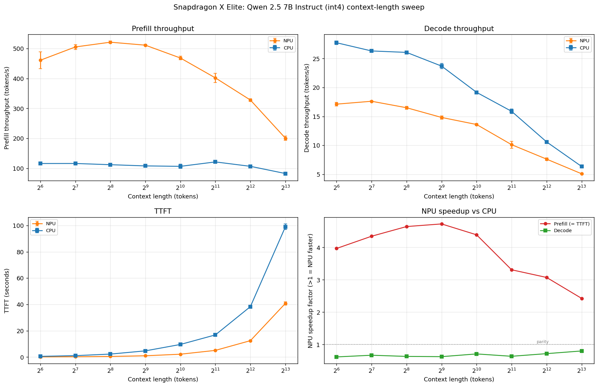

# Snapdragon X Elite / X2 Elite LLM Benchmarks

> Running and benchmarking int4 LLM inference on Qualcomm Snapdragon NPU via ONNX Runtime QNN Execution Provider on Windows ARM64.

> Platform: Windows 11 ARM64 on Snapdragon X Elite / X2 Elite + Python 3.14. Not compatible with x86_64, Linux, or macOS.

## Current Result

This repository is a reproducible benchmark harness for comparing ORT-GenAI + QNN NPU inference against ORT-GenAI CPU inference on Qualcomm Windows ARM64 devices.

The current checked-in result was freshly rerun on a Snapdragon X2 Elite machine with Qwen 2.5 7B Instruct int4 from Foundry Local:



Full table: [`results/context_sweep_qwen7b.md`](results/context_sweep_qwen7b.md)

| Ctx tokens | QNN prefill | CPU prefill | QNN decode | CPU decode | QNN TTFT | CPU TTFT |
|---:|---:|---:|---:|---:|---:|---:|
| 64 | 461.10 t/s | 116.21 t/s | 17.12 t/s | 27.74 t/s | 0.139 s | 0.551 s |
| 256 | 521.32 t/s | 112.24 t/s | 16.50 t/s | 26.07 t/s | 0.491 s | 2.281 s |
| 1024 | 468.56 t/s | 106.75 t/s | 13.60 t/s | 19.16 t/s | 2.185 s | 9.592 s |
| 4096 | 328.15 t/s | 106.81 t/s | 7.61 t/s | 10.59 t/s | 12.482 s | 38.350 s |
| 8192 | 200.75 t/s | 82.75 t/s | 5.08 t/s | 6.34 t/s | 40.807 s | 98.997 s |

## Takeaways

1. **NPU is still the prefill / TTFT engine.**
   On Qwen 7B, QNN prefill is roughly 2.4-4.6x faster than CPU across ctx=64 to ctx=8192.

2. **CPU still wins decode on this Qwen 7B run.**
   CPU decode is faster at every tested context length, though the gap narrows from about 1.6x at ctx=64 to about 1.25x at ctx=8192.

3. **X2 Elite changes the baseline.**
   Compared with the earlier X Elite notes in [`docs/findings.md`](docs/findings.md), both CPU and QNN numbers are higher. The practical routing question remains phase-aware: use NPU for long prompt prefill, then decide whether decode should remain on NPU or move to CPU.

4. **The next prototype target is still hybrid execution.**
   The planned experiment is NPU prefill + CPU decode via KV-cache handoff. The KV tensors have matching ONNX I/O shape and dtype across the tested QNN and CPU models, so the handoff appears mechanically feasible. See [`docs/findings.md`](docs/findings.md#f6-plan-a-kv-cache-handoff-is-plug-and-play).

## Reproduce

### Setup

Use the pre-built Windows ARM64 `onnxruntime-genai` wheel and matching DLL bundle from this repo's GitHub Releases:

```powershell
pixi install
pixi run python -m pip install --force-reinstall --no-deps <path-or-url-to-onnxruntime_genai-win_arm64.whl>
Expand-Archive <path-to-release-dll-zip> .\release-dlls -Force
pixi run install-genai --skip-wheel --dll-dir .\release-dlls
pixi run check
```

Download the Foundry Local models if they are not already cached:

```powershell
foundry model download qwen2.5-7b-instruct-qnn-npu:2
foundry model download qwen2.5-7b-instruct-generic-cpu:4
```

Run the default Qwen 7B QNN + CPU sweep:

```powershell
pixi run context-sweep --model qwen7b --backends both --output-md results/context_sweep_qwen7b.md
pixi run plot results/context_sweep_qwen7b.md
```

The sweep helper accepts either Foundry model IDs or explicit model directories:

```powershell
pixi run context-sweep `
  --qnn-model-id qwen2.5-7b-instruct-qnn-npu:2 `
  --cpu-model-id qwen2.5-7b-instruct-generic-cpu:4 `
  --contexts 64,128,256,512,1024,2048,4096,8192 `
  --output-md results/context_sweep_qwen7b.md `
  --overwrite
```

## Useful Commands

```powershell
pixi run check
pixi run context-sweep --help
pixi run benchmark --help
pixi run plot results/context_sweep_qwen7b.md
make verify NPU_MODEL_DIR=<qnn-model-dir> CPU_MODEL_DIR=<cpu-model-dir>
make profile MODEL_DIR=<model-dir> BACKEND=ort-qnn
```

## More Documentation

- **Setup and troubleshooting**: [`docs/setup.md`](docs/setup.md)
- **Full findings log and older X Elite multi-model notes**: [`docs/findings.md`](docs/findings.md)
- **Current working plan**: [`PROGRESS.md`](PROGRESS.md)
- **Benchmark results**: [`results/`](results/)

## Repository Map

```text
qnn/
├── README.md                         # Current result and reproduction path
├── PROGRESS.md                       # Current plan and short handoff notes
├── docs/
│   ├── setup.md                      # Build, install, models, pitfalls
│   └── findings.md                   # Longer research notes and historical findings
├── results/                          # Benchmark markdown tables and plots
├── benchmark.py                      # Multi-backend benchmark harness
├── plot.py                           # Context-sweep plotting
├── profile.py                        # ORT per-op profiling
├── verify.py                         # NPU vs CPU correctness check
├── llm_infer_ort_qnn.py              # ORT-GenAI + QNN EP inference
├── llm_infer_ort_cpu.py              # ORT-GenAI + CPU EP inference
└── scripts/                          # Setup, install, sweep, and build helpers
```
