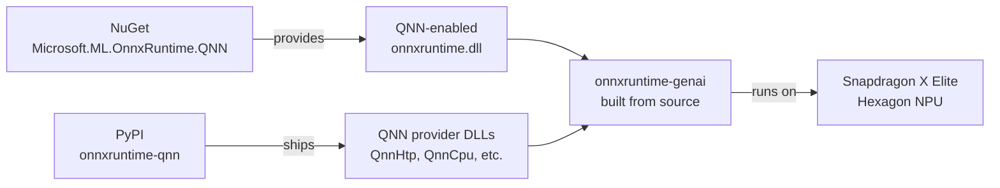

# Setup, build, and troubleshooting

This document contains the operational details that are intentionally kept out of the README.

## Architecture

How the DLLs fit together:



- **QNN DLLs** come from the `onnxruntime-qnn` PyPI package.
- **onnxruntime.dll with QNN EP** comes from the NuGet `Microsoft.ML.OnnxRuntime.QNN` package, auto-downloaded during the genai source build.
- **onnxruntime-genai** must be built from source if you are not using the pre-built wheel.
- **Runtime DLL placement matters**: both NuGet ORT DLLs and QNN provider DLLs must coexist in the `onnxruntime_genai` package directory.

## Prerequisites

- **OS**: Windows 11 ARM64 on Snapdragon X Elite / Plus
- **Visual Studio 2026** with C++ ARM64 build tools
- **Python 3.14.3**
- **CMake 4.3+**
- **Ninja 1.11+**
- **Pixi**
- **onnxruntime-qnn**
- **onnxruntime-genai** with QNN support

## Quick start

### Option 0: one-shot bootstrap

For a blank Windows 11 ARM64 device, run from elevated PowerShell:

```powershell
iwr -useb https://raw.githubusercontent.com/dakehero/snapdragon-xelite-llm-example/main/scripts/bootstrap_cloud.ps1 | iex
```

What it does:

- Installs git, pixi, and Foundry Local via winget.
- Clones the repo.
- Sets up the pixi environment.
- Downloads the pre-built wheel from Releases.
- Pulls Qwen 2.5 7B NPU and CPU models.
- Runs smoke test plus full context-length sweep.

Result lands in `results/context_sweep_qwen7b.md`.

> **Note on Smart App Control**: if it is ON, the script will warn and exit. You need to turn it off manually from Windows Settings. SAC cannot be re-enabled without a Windows reinstall.

### Option 1: use pre-built wheel

For Windows ARM64 with Python 3.14, download the pre-built wheel from GitHub Releases:

```powershell
pixi install

$WheelUrl = "https://github.com/dakehero/snapdragon-xelite-llm-example/releases/download/<VERSION>/onnxruntime_genai-0.14.0.dev0-cp314-cp314-win_arm64.whl"
pixi run python -m pip install --force-reinstall --no-deps $WheelUrl

pixi run python scripts/install.py

make test
make run MODEL_DIR=/path/to/qnn-model
```

### Option 2: build from source

If you need a different Python version or want to modify the source:

```powershell
pixi install

make build-genai QNN_SDK_ROOT="C:\QNN\qairt\2.45.0.260326"

make test
make run MODEL_DIR=/path/to/qnn-model
```

## Build paths

### Path A: simple build

Use `make build` or `make build-genai`.

- `make build` is an alias for `make build-genai`.
- Downloads pre-built `Microsoft.ML.OnnxRuntime.QNN` from NuGet automatically.
- Links genai against the NuGet QNN-enabled `onnxruntime.dll`.
- Fastest option.

### Path B: full source build

Use `make build-ort` then `make build-genai`.

- First builds onnxruntime base from source with QNN EP.
- Then builds genai linked against your custom onnxruntime.
- Use this if you need to modify onnxruntime itself.

> `onnxruntime-genai` is intentionally excluded from `pixi.toml` to prevent `pixi install` from overwriting the custom-built QNN wheel with the standard PyPI version.

## Getting a model

The project does not bundle models.

### Option A: download a reference ONNX model from HuggingFace

Good for CPU baseline and `verify`:

```powershell
make download-model
```

Or pick your own:

```powershell
pixi run python scripts/download_model.py --repo <hf-repo> --subfolder <path> --dest ./models/<name>
```

### Option B: use Microsoft Foundry Local

This is the most convenient source for QNN-optimized models today.

- Install Foundry Local.
- Models are cached under `~/.foundry/cache/models/`.
- Point `ORT_QNN_MODEL` at the cached path, for example:

```text
C:\Users\<user>\.foundry\cache\models\Microsoft\qwen2.5-7b-instruct-qnn-npu-2\v2
```

## Verification and benchmarks

```powershell
make check
make test
make verify NPU_MODEL_DIR=/path/to/qnn-model CPU_MODEL_DIR=/path/to/cpu-model

make run-ort-qnn MODEL_DIR=/path/to/qnn-model
make run-ort-cpu MODEL_DIR=/path/to/cpu-model

make benchmark ORT_QNN_MODEL=/path/qnn-model ORT_CPU_MODEL=/path/cpu-model RUNS=5

make profile MODEL_DIR=/path/to/model BACKEND=ort-qnn
```

For arbitrary backend combinations:

```powershell
make benchmark BACKENDS='--backend ort-qnn:llm_infer_ort_qnn.py:/path/a --backend genie:llm_infer_genie.py:/path/b'
```

`make verify` runs greedy decoding on both NPU and CPU with the same prompt and compares token IDs. Small divergence is expected for quantized QNN models; the script reports the first divergence position and both decoded outputs.

## Context-sweep reproduction

### Qwen 7B

```powershell
make benchmark-context `
  ORT_QNN_MODEL="C:\Users\<you>\.foundry\cache\models\Microsoft\qwen2.5-7b-instruct-qnn-npu-2\v2" `
  ORT_CPU_MODEL="C:\Users\<you>\.foundry\cache\models\Microsoft\qwen2.5-7b-instruct-generic-cpu-4\v4"

make plot INPUTS=results/context_sweep_qwen7b.md
```

### Qwen 1.5B

```powershell
make benchmark-context `
  ORT_QNN_MODEL="C:\Users\<you>\.foundry\cache\models\Microsoft\qwen2.5-1.5b-instruct-qnn-npu-2\v2" `
  ORT_CPU_MODEL="C:\Users\<you>\.foundry\cache\models\Microsoft\qwen2.5-1.5b-instruct-generic-cpu-4\v4" `
  OUTPUT_MD=results/context_sweep_qwen1.5b.md
```

### R1-Distill 14B

```powershell
make benchmark-context `
  ORT_QNN_MODEL="C:\Users\<you>\.foundry\cache\models\Microsoft\deepseek-r1-distill-qwen-14b-qnn-npu-1\qnn-deepseek-r1-distill-qwen-14b" `
  ORT_CPU_MODEL="C:\Users\<you>\.foundry\cache\models\Microsoft\deepseek-r1-distill-qwen-14b-generic-cpu-4\v4" `
  CONTEXTS=64,128,256,512,1024,2048,4096 `
  OUTPUT_MD=results/context_sweep_r1distill14b.md
```

### Combined plot

```powershell
pixi run python plot.py results/context_sweep_qwen7b.md results/context_sweep_qwen1.5b.md results/context_sweep_r1distill14b.md --labels "Qwen 7B" "Qwen 1.5B" "R1-Distill 14B" --out results/context_sweep_all_models.png
```

## Working inference script pattern

```python
import os
import onnxruntime_qnn
import onnxruntime_genai as og

qnn_dir = os.path.dirname(onnxruntime_qnn.__file__)
genai_dir = os.path.dirname(og.__file__)
os.add_dll_directory(qnn_dir)
os.add_dll_directory(genai_dir)
os.environ["PATH"] = genai_dir + os.pathsep + qnn_dir + os.pathsep + os.environ.get("PATH", "")

og.register_execution_provider_library('QNNExecutionProvider', onnxruntime_qnn.get_library_path())

model_dir = r"C:\Users\dake_\.foundry\cache\models\Microsoft\qwen2.5-7b-instruct-qnn-npu-2\v2"
config = og.Config(model_dir)
config.clear_providers()
config.append_provider('qnn')
model = og.Model(config)

tokenizer = og.Tokenizer(model)
prompt = "Hello"
input_tokens = tokenizer.encode(prompt)
params = og.GeneratorParams(model)
params.set_search_options(max_length=128)
params.input_ids = input_tokens
generator = og.Generator(model, params)

while not generator.is_done():
    generator.generate_next_token()
    tokens = generator.get_next_tokens()

output = tokenizer.decode(tokens)
print(output)
```

## Pitfalls and solutions

### 1. PyPI `onnxruntime-genai` does not include QNN support

**Symptom**: `og.Model(config)` throws:

```text
RuntimeError: QNN execution provider is not supported in this build.
```

**Root cause**: The standard `onnxruntime-genai` wheel on PyPI is built without QNN. Even though `og.is_qnn_available()` returns `True`, the actual EP registration fails because the underlying `onnxruntime.dll` linked by genai does not know about QNN.

**Solution**: Build `onnxruntime-genai` from source or use the pre-built wheel from this repo's Releases.

### 2. QNN EP registration name must be `QNNExecutionProvider`

**Symptom**: Same error as above, even after building from source and calling `og.register_execution_provider_library('qnn', ...)`.

**Root cause**: `onnxruntime-genai` internally calls `FindRegisteredEpDevices("QNNExecutionProvider")`. If you register with `"qnn"`, lookup fails.

**Solution**:

```python
og.register_execution_provider_library('QNNExecutionProvider', onnxruntime_qnn.get_library_path())
```

### 3. MSVC requires `/EHsc` for C++ exception handling

**Symptom**: Build fails with `error C2220` and `warning C4530`.

**Root cause**: The genai source code uses C++ exceptions, but the Ninja + MSVC build does not enable exception handling by default.

**Solution**: Pass `--cmake_extra_defines CMAKE_CXX_FLAGS=/EHsc` to the build command.

### 4. DLL version mismatch between PyPI ORT and NuGet ORT

**Symptom**: `og.Model(config)` still fails after building genai from source, even with the correct registration name.

**Root cause**: The build links against NuGet's `onnxruntime.dll`, but runtime Python may load PyPI's `onnxruntime.dll` from `onnxruntime/capi/`. The DLLs can have different ABIs.

**Solution**: Copy the NuGet `onnxruntime.dll` and all QNN DLLs into the `onnxruntime_genai` package directory:

```powershell
$genaiDir = ".pixi\envs\default\Lib\site-packages\onnxruntime_genai"
Copy-Item "build\Windows\RelWithDebInfo\_deps\ortlib-src\runtimes\win-arm64\native\*.dll" $genaiDir -Force
Copy-Item ".pixi\envs\default\Lib\site-packages\onnxruntime_qnn\*.dll" $genaiDir -Force
```

### 5. Python 3.12 is not available for win-arm64 on conda-forge

**Symptom**: `pixi install` fails because `python = "3.12"` has no win-arm64 build.

**Solution**: Use `python = "3.14.*"` in `pixi.toml`.

### 6. GenAI API change: `get_next_tokens()` replaces `get_next_token()`

**Symptom**:

```text
AttributeError: 'Generator' object has no attribute 'get_next_token'
```

**Solution**: Use `generator.get_next_tokens()`.

### 7. Low-bit quantized models may regurgitate training-data patterns

When prompted with a bare completion such as `"The capital of France is"`, int4-quantized QNN models may fall into training-data patterns like multiple-choice questions instead of natural continuations.

This is not necessarily a QNN bug. It is a consequence of logit distribution flattening under aggressive quantization.

Empirical test on Qwen 2.5 7B int4:

| Prompt style | Result |
|---|---|
| Bare: `"The capital of France is"` | NPU and CPU diverge at token 2; NPU goes into multiple-choice format |
| Chat-templated | NPU and CPU produce bit-exact identical output: `"The capital of France is Paris."` |

**Takeaway**: Use the model's chat template for production use. `make verify` uses the bare-completion prompt by default intentionally to stress-test this behavior.

## Pre-built wheels

Pre-built wheels for Windows ARM64 are available on GitHub Releases.
